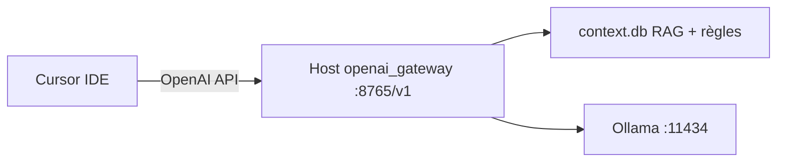

# Roadmap post-V1

Feuille de route après la V1 : intégration **Cursor IDE** (inférence locale sans crédits cloud) et **génération multimédia** (image, voix, musique, vidéo). Référence produit : page marketing `/cursor`, guide [docs/CURSOR.md](./CURSOR.md).

---

## Jalons — intégration Cursor

Objectif : permettre à Cursor d'utiliser le Host OwnMyOwnAI pour l'inférence (0 crédit Cursor) tout en conservant RAG, règles projet (`.cursorrules` / `.ownmyownai/rules.md`) et sandbox outils.

### Trois chemins d'intégration

| Chemin | Description | RAG / règles OMOA | Statut |
|--------|-------------|-------------------|--------|
| **1 — Ollama direct** | Cursor → `http://127.0.0.1:11434/v1` (clé arbitraire, modèle Ollama installé) | Non — contourne le Host | Disponible si Ollama tourne |
| **2 — Gateway Host** | Cursor → `http://127.0.0.1:8765/v1` (`openai_gateway.rs`) : proxy OpenAI-compatible local | Oui — pipeline chat Host | **P0** — à implémenter |
| **3 — MCP serveur** | Package `packages/omoa-mcp-server` (stdio) : `search_chunks`, `read_file`, `list_dir` | Contexte OMOA en complément du chemin 1 ou 2 | **P1** — à implémenter |

### Jalons par phase

| Phase | Jalons | Livrables clés |
|-------|--------|----------------|
| **P0** (2–4 sem.) | Gateway OpenAI local | `openai_gateway.rs` : `GET /v1/models`, `POST /v1/chat/completions` (SSE) ; token Bearer local (`cursorApiToken`) ; settings `cursorGatewayEnabled` / `cursorGatewayPort` ; panneau Host `CursorIntegration.tsx` ; snippet JSON Settings Cursor ; factorisation `chat_pipeline.rs` (relay + gateway) |
| **P0** | Doc & fallback | `docs/CURSOR.md` (3 chemins, dépannage) ; chemin Ollama direct documenté comme solution immédiate sans RAG |
| **P1** (4–6 sem.) | MCP + polish | Serveur MCP stdio ; wizard « Ajouter à Cursor » (`.cursor/mcp.json`) ; header `X-Project-Id` pour contexte projet ; page onboarding « Connecter Cursor » ; tests tool-calling OpenAI via gateway |
| **P2** | Sécurité & ops | Rate limiting gateway ; option localhost vs LAN ; audit trail accès gateway ; modèle de menace dans `docs/SECURITY.md` |

### Dépendances techniques

- Réutiliser `relay.rs` (injection RAG, mémoire, règles, `assistant_output.rs`) — ne pas dupliquer la logique chat.
- Modèles via `list_available_models()` (`providers/mod.rs`) ; file d'attente `chat_queue.rs` partagée avec le chat web.
- Règles projet déjà actives via `omoa-project-rules` — le gateway doit les injecter comme le relay.



---

## Jalons — génération média (post-V1)

**État actuel (V1)** : vision = analyse RAG uniquement (`context/vision.rs`, `describe_image`) ; `creatives.rs` persiste les artefacts markdown (blocs ` ```artifact `) dans `resolved_creatives_dir()` — pas de pipeline image / vidéo / musique / voix.

### Architecture cible

| Média | Option locale (Host / PC) | Option cloud (keyring Host) | Module cible |
|-------|---------------------------|----------------------------|--------------|
| **Image** | ComfyUI / SD WebUI / `ollama run flux` | OpenAI DALL-E via `providers/openai.rs` | `media/image.rs` |
| **Voix (TTS/STT)** | Piper TTS / edge-tts ; Whisper.cpp (STT) | OpenAI TTS | `media/voice.rs` |
| **Musique** | MusicGen / AudioCraft (GPU optionnel, `hardware.rs`) | — | `media/music.rs` |
| **Vidéo** | Slideshow images → FFmpeg + piste audio TTS | APIs tierces optionnelles | `media/video.rs` |

Stockage : étendre `creatives/` (PNG, MP3, WAV + `.meta.json`) ; galerie Host + panneau web (extension de `artifacts-panel.tsx`).

### Protocole & backend

| Jalon | Détail | Phase |
|-------|--------|-------|
| Types WS `media.generate` / `media.progress` / `media.done` | `packages/protocol/src/index.ts` | P2 |
| Module `media/mod.rs` + jobs async | `apps/runner/src-tauri/src/media/` | P2 |
| Image locale (Flux Ollama ou ComfyUI) | Settings endpoint configurable | P2 |
| Image cloud (optionnel) | `images/generations` dans `providers/openai.rs` | P2 |
| Voix TTS/STT locale | Piper + Whisper.cpp | P2 |
| Musique locale | MusicGen wrapper | P3 |
| Vidéo minimale | Images → FFmpeg + audio TTS | P3 |
| UI `MediaGalleryPanel.tsx` | Preview, téléchargement, suppression | P2 |
| Statut génération dans `get_host_status` | Heartbeat / tray | P2 |

### Priorisation média

| Phase | Focus | Durée indic. |
|-------|-------|--------------|
| **P2** | MVP image + voix TTS ; protocole WS ; galerie web | 6–10 sem. |
| **P3** | Musique, vidéo slideshow, STT fichiers audio liés | Continu |

Guide utilisateur prévu : `docs/MEDIA_GENERATION.md` (prérequis GPU, modèles, limites).

---

## Modèles cloud (optionnels)

OpenAI et Anthropic sont **optionnels** — routage depuis le Host uniquement :

- Clés API stockées en keyring Host (`cloud_keys.rs`), repli fichier local chiffré DPAPI si keyring indisponible
- Modèles préfixés `openai:` / `anthropic:` ; activation par fournisseur dans `settings.json`
- Le relay transporte le chat mais **jamais** les clés API vers le cloud OwnMyOwnAI
- Commandes Tauri : `get_cloud_providers_status`, `save_cloud_provider_key`, `delete_cloud_provider_key`

**Statut** : implémenté côté Host (v0.3).

## Fonctionnalités minimales livrées (P4)

| Fonctionnalité | Statut |
|----------------|--------|
| Sessions simultanées + file d'attente FIFO (`chat_queue.rs`) | Toujours actif — plusieurs PC/onglets, une génération Ollama à la fois |
| Routage multi-modèle par tâche (`modelRouting` dans `settings.json`) | Petit modèle résumé, gros rédaction — intent + fallback |
| Historique conversations | Host SQLite + sync WS ; métadonnées locales en secours |
| Branches de conversation | Fork depuis message N ; arbre local (Host + localStorage) |
| RAG amélioré | Chunking ~tokens + `ragTopK` / `ragChunkTokens` dans settings |
| DOCX | Non supporté — message d'erreur explicite |

## Pistes futures

- MCP servers côté Host (`mcp.*` WS + builtin filesystem + serveurs externes via stdio) — implémenté v0.3
- Terminal intégré (allowlist Host + streaming WS `terminal.*`) — implémenté v0.3
- Historique complet runner (SQLite optionnel)
- Extraction PDF robuste (crate dédiée ou OCR)
- Tests E2E pairing avec mock Supabase
- ~~Session partagée multi-onglets (Web Locks API)~~ — remplacé par file d'attente Host + onglets indépendants
- Modèle par défaut Qwen/Mistral (alternative Llama) — voir `settings.rs` / `ModelSetup.tsx`
- UI Host paramètres unifiée (cloud, MCP, mémoire, routage) — voir jalons P1 produit

## Références

| Document | Contenu |
|----------|---------|
| `docs/SUBAGENTS.md` | Registre skills Cursor / Claude / Codex |
| `docs/V1_CHECKLIST.md` | Critères d'acceptation V1 |
| `docs/ARCHITECTURE.md` | Couches relay / Host / web |
| `docs/CURSOR.md` | Guide intégration Cursor (chemin Ollama direct + gateway/MCP) |
| `docs/MEDIA_GENERATION.md` | Guide génération média (à créer, P2) |
