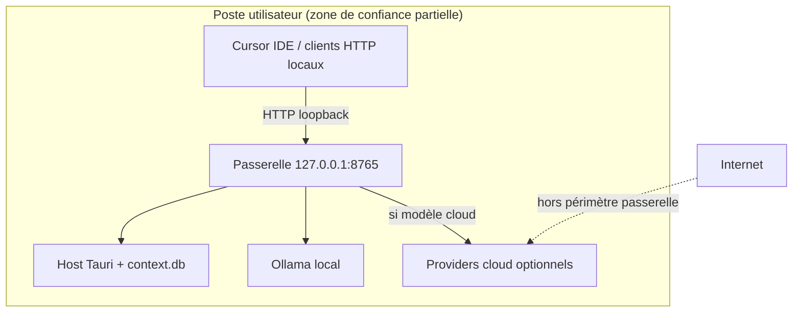

# Sécurité OwnMyOwnAI

## Auth Supabase

### `handle_new_user`

La fonction `public.handle_new_user()` est déclenchée automatiquement par le trigger `on_auth_user_created` sur `auth.users`. Elle s'exécute en `SECURITY DEFINER`.

**Mesure appliquée** : `REVOKE EXECUTE` pour `PUBLIC`, `anon` et `authenticated`. Les clients ne peuvent plus appeler cette fonction via RPC ; seul le trigger système l'invoque.

### Protection mots de passe compromis (leaked password protection)

Supabase Auth peut refuser les mots de passe présents dans des bases de fuites (Have I Been Pwned).

**Configuration manuelle** (Dashboard Supabase → Authentication → Settings → Password Security) :

1. Activer **Leaked password protection**
2. Vérifier que la politique de complexité correspond à vos exigences

Cette option n'est pas activable via migration SQL ; documentez son état dans votre checklist de déploiement.

## `host_credentials`

La table `host_credentials` **n'a pas de politique RLS client**. C'est intentionnel :

- Les secrets device ne doivent jamais être lisibles depuis le navigateur
- Seules les Edge Functions (rôle `service_role`) y accèdent (`complete-pairing`, `runner-heartbeat`, etc.)

Ne pas ajouter de policy `SELECT` pour `authenticated`.

## Storage `host-releases`

Le bucket reste public pour le téléchargement direct du ZIP portable, mais le listing du bucket est restreint : seul l'objet `latest/OwnMyOwnAI-Host-portable-x64.zip` est lisible anonymement.

## Chat et données sensibles

- Les messages de chat ne sont **pas** stockés dans Supabase
- Le contexte RAG (documents, chunks) reste **local** sur le PC hôte

## Sources de contexte liées (Host v0.2.0)

- Les chemins liés (fichier, dossier, disque) sont configurés **uniquement** depuis l'app Host via le sélecteur natif Tauri
- Les fichiers sources ne sont **pas** recopiés : `documents.filepath` pointe vers le chemin réel (Google Drive local, etc.)
- Supprimer un lien ou un document indexé **ne supprime jamais** le fichier source sur le disque
- Le panneau web affiche le statut en lecture seule ; aucun accès direct du navigateur aux chemins locaux
- Le scan de disque entier est limité (500 fichiers, profondeur 8, exclusions dossiers système Windows)

## Relay JWT

`RELAY_JWT_SECRET` doit être identique entre Supabase Edge Functions et le worker Cloudflare Relay. Utilisez une chaîne aléatoire d'au moins 32 caractères.

## Passerelle OpenAI locale (Cursor)

La passerelle (`apps/runner/src-tauri/src/openai_gateway.rs`) expose une API compatible OpenAI sur `http://127.0.0.1:8765/v1` pour que Cursor (ou tout client HTTP local) utilise le pipeline chat du Host : RAG, règles projet, mémoire utilisateur, puis Ollama ou providers cloud.

### Périmètre et objectifs

| Élément | Détail |
|---------|--------|
| Composant | Serveur HTTP Axum embarqué dans le Host Tauri |
| Endpoints | `GET /health`, `GET /v1/models`, `POST /v1/chat/completions` (JSON ou SSE) |
| Écoute réseau | `127.0.0.1` par défaut (`cursorGatewayLan: false`) ; option LAN (`0.0.0.0`, `cursorGatewayLan: true`) — port `8765` (`cursorGatewayPort`) |
| Données en transit | Requêtes et réponses restent sur la machine ; aucun transit Supabase pour le chat |

**Objectif de sécurité** : permettre l'intégration IDE sans exposer le contexte local ni les clés cloud à Internet, tout en limitant l'abus par d'autres processus ou utilisateurs sur le même poste.

### Actifs concernés

- **Contexte RAG** (`context.db`) : chunks, chemins de fichiers liés, instructions de bases de connaissances
- **Règles projet** : `.ownmyownai/rules.md`, `.cursorrules`
- **Mémoire utilisateur** (`user_memory`) si `userMemoryEnabled` est actif
- **Clés API cloud** (OpenAI, Anthropic) stockées via keyring / fichier chiffré local (`cloud_keys.rs`)
- **Capacité d'inférence** : charge CPU/GPU Ollama, quotas et coûts des providers cloud
- **Journal d'audit local** (`audit_log`, action `agent_access` lors d'un accès RAG via la passerelle)

### Frontière de confiance

- **Hors périmètre** : le relay web, Supabase, le pairing device — documentés ailleurs dans ce fichier.
- **Frontière critique** : tout processus capable d'ouvrir une connexion TCP vers `127.0.0.1:8765` est traité comme client potentiel (pas seulement Cursor).

### Acteurs de menace

| Acteur | Capacité | Motivation typique |
|--------|----------|-------------------|
| Logiciel malveillant local | Appels HTTP vers loopback | Exfiltration de contexte RAG, consommation GPU, envoi de prompts vers cloud avec vos clés |
| Autre utilisateur Windows (session partagée) | Même machine, compte distinct | Accès indirect si un service écoute au-delà de localhost (non prévu aujourd'hui) |
| Prompt / dépôt malveillant dans Cursor | Injection via l'IDE | Manipulation du contexte injecté, fuite indirecte vers un modèle cloud |
| Erreur de configuration utilisateur | Proxy, tunnel, partage d'écran | Exposition involontaire du port local |

### Surface d'attaque et vecteurs

1. **`POST /v1/chat/completions`** — corps JSON jusqu'à 2 Mo ; déclenche enrichissement contexte et inférence.
2. **En-tête `X-Project-Id`** — sélectionne le projet actif et ses bases RAG ; un ID valide oriente le contexte injecté.
3. **`GET /v1/models`** — énumère les modèles Ollama installés et les modèles cloud configurés (fuite d'inventaire locale).
4. **Modèles cloud** (`openai:*`, `anthropic:*`) — le contenu enrichi (RAG, mémoire, règles) peut partir vers le provider si le modèle et la clé sont actifs.
5. **Mentions et RAG** (`@fichier`, `@dossier`) — même logique que le relay ; accès aux chunks indexés des bases liées au projet.

### Contrôles en place

| Contrôle | Implémentation | Limite connue |
|----------|----------------|---------------|
| Écoute loopback / LAN | `127.0.0.1` par défaut ; `cursorGatewayLan` pour `0.0.0.0` | En mode LAN, tout client du réseau local peut tenter d'appeler la passerelle (Bearer requis) |
| Validation modèle | `is_available_model()` — refus des modèles absents ou non configurés | N'empêche pas l'abus d'un modèle légitime |
| Plafond historique | 20 derniers messages conservés par requête | Réduit la fenêtre d'injection, pas le volume de requêtes |
| Plafond corps | 2 Mo max sur le body JSON | Protection mémoire basique |
| Validation projet | `X-Project-Id` doit référencer un projet existant | En-tête absent → projet actif du Host |
| Anthropic via passerelle | `501 Not Implemented` | Évite un chemin cloud non testé |
| Audit RAG | `log_audit(AgentAccess, "openai_gateway", …)` quand des bases sont touchées | Journal local uniquement ; pas d'alerte temps réel |
| Token Bearer (`cursorApiToken`) | Généré à l'appairage, stocké keyring / `credentials.json`, affiché dans `CursorIntegration.tsx` | **Non vérifié côté serveur HTTP à ce jour** — voir risques résiduels |
| Toggle `cursorGatewayEnabled` | Préférence utilisateur dans `settings.json` | **Le serveur démarre au lancement du Host** ; le toggle est informatif pour l'UI, pas un interrupteur réseau |
| Mode air-gapped | `airGapped` désactive relay/heartbeat | N'empêche pas les modèles cloud si configurés et sélectionnés dans Cursor |

### Analyse STRIDE (synthèse)

| Catégorie | Menace | Mitigation actuelle | Écart |
|-----------|--------|---------------------|-------|
| **S**poofing | Client se fait passer pour Cursor | Token Bearer prévu | Vérification Bearer non implémentée dans `openai_gateway.rs` |
| **T**ampering | Modification des messages en transit | Loopback uniquement | TLS absent (acceptable en local) |
| **R**epudiation | Négation d'un accès RAG | `audit_log` partiel (`agent_access`) | Pas de corrélation IP/client (loopback) |
| **I**nformation disclosure | Fuite RAG / chemins / mémoire | Pas d'exposition WAN | Tout processus local peut interroger la passerelle |
| **D**enial of service | Rafales de completions | — | Pas de rate limiting (jalon P2) |
| **E**levation | Prompt injection → actions outils Cursor | Hors périmètre Host | Responsabilité partagée IDE + modèle |

### Risques résiduels et jalons P2

Priorité documentée dans [ROADMAP.md](./ROADMAP.md) (phase P2 — Sécurité & ops) :

1. **Authentification Bearer** — comparer `Authorization: Bearer <cursorApiToken>` via `cursor_api_token_for_gateway()` sur chaque route `/v1/*` ; répondre `401` si absent ou invalide.
2. **Rate limiting** — limiter les requêtes par fenêtre temporelle pour protéger Ollama et les quotas cloud.
3. **Interrupteur réel** — ne pas lier le socket HTTP si `cursorGatewayEnabled` est `false`.
4. **Option localhost vs LAN** — livré (`cursorGatewayLan`) ; en mode LAN, documenter le risque réseau et conserver l'auth Bearer obligatoire.
5. **Audit étendu** — journaliser chaque appel `/v1/chat/completions` (modèle, projet, présence RAG), pas seulement les accès avec chunks.

### Recommandations opérationnelles

- Préférer des **modèles Ollama locaux** dans Cursor lorsque le contexte est sensible ; les modèles `openai:*` envoient le prompt enrichi au cloud.
- Ne pas exposer le port `8765` via reverse proxy, SSH `-R` ou conteneur sans comprendre que **toute la pile RAG devient accessible**.
- Conserver le Host sur un **compte Windows personnel** ; éviter les sessions partagées sur une machine contenant des bases indexées sensibles.
- Régénérer le token (`cursorApiToken`) en cas de fuite (désappairage / réappairage du Host) une fois la vérification Bearer livrée.
- Consulter le journal d'audit Host après usage Cursor sur des projets confidentiels (`agent_access` / `openai_gateway`).

### Références code

| Fichier | Rôle |
|---------|------|
| `openai_gateway.rs` | Serveur HTTP, enrichissement messages, audit RAG |
| `credentials.rs` | Génération et stockage `cursorApiToken` |
| `settings.rs` | `cursorGatewayEnabled`, `cursorGatewayPort`, `cursorGatewayLan` |
| `CursorIntegration.tsx` | UI copie URL / token / snippet Cursor |
| [CURSOR.md](./CURSOR.md) | Guide de configuration utilisateur |
